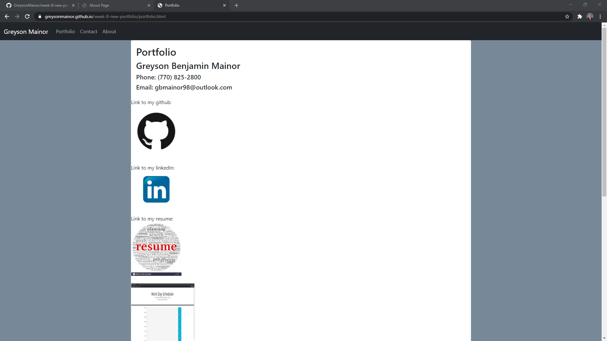
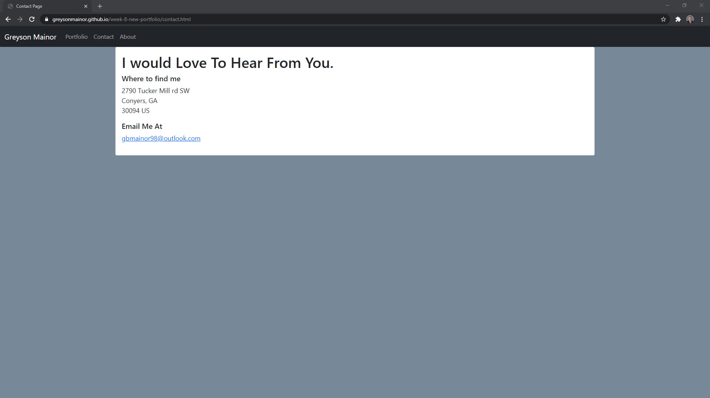
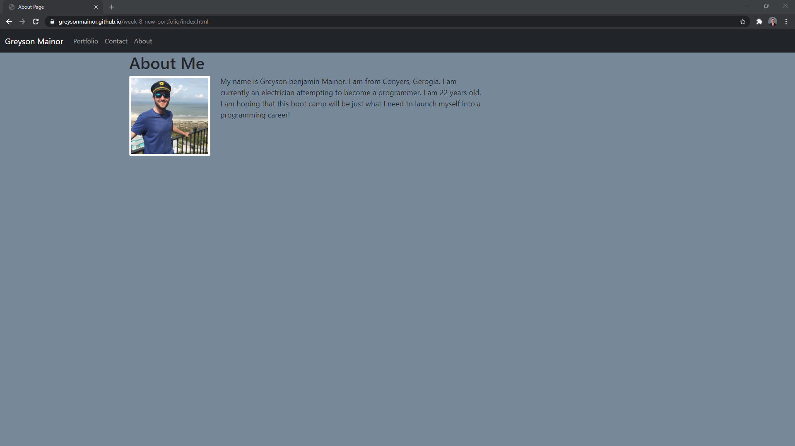

# week-8-new-portfolio

## Description/about this project
The objective of this homework was to create a responsive portfolio with links to my github, linkedIn, and resume.
This project was focused on using the knowledge I have gained over the past few weeks to polish my portfolio and include recent works.  This project allows potential employers to view information about me and what I have coded in one easily manageable webpage.  I learned how to properly link images into a README as well as how to place .png's into my code so that it redirects to a download.  